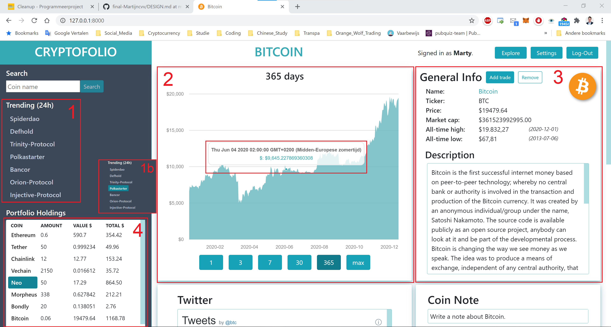
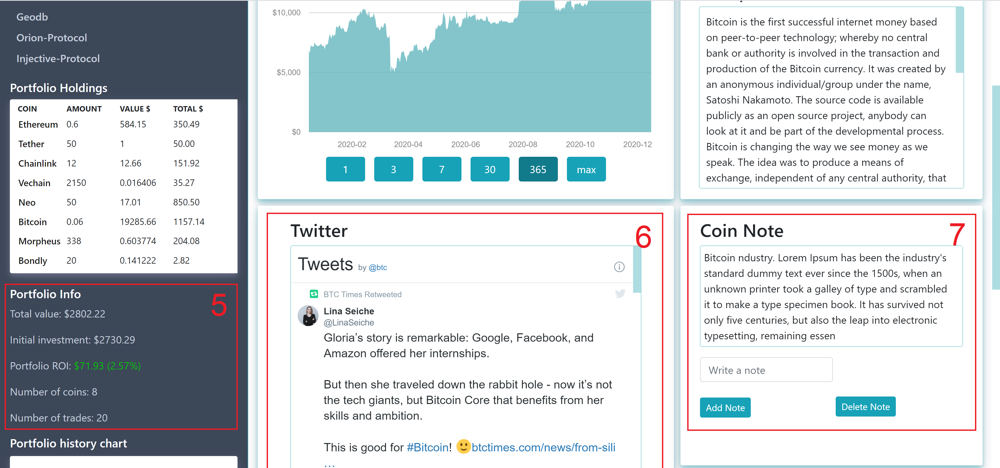
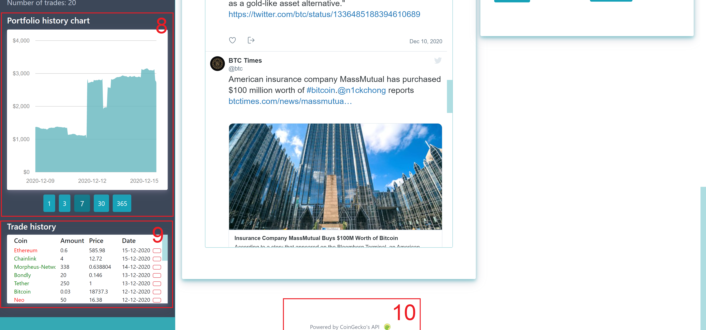

# Design Document
The website is build as a Single Page Website by combining Python, HTML, CSS and Javascript with the CSS framework Bootstrap and the python-based web framework Django.
- The layout of the website is build with HTML and CSS.
- The information on the pages is a combination of Python and Javascript.
- User data is stored with Python and Django
- Cryptocurrency data is fetched with Javascript from CoinGecko, a cryptocurrency data aggregation website, via an API.

### General Website images
 
 

1. Top 7 trending coins in the past 24 hours.
2. Historical price graph of the by the user selected cryptocurrency. Timeframes: 1 day, 3 days, 7 days, 30 days, 365 days and max available timeframe.
3. General information about the by the user selected cryptocurrency.
4. User's portfolio info: coins, amount, current value of coin and total value of coin holding.
5. General user portfolio info; total value, initial investment, current return on investment (green: profit / red: loss), nr of coins in portfolio, nr of trades executed.
6. Twitter timeline of the by the user selected cryptocurrency.
7. Note field for the user to write down a note about the selected cryptocurrency; e.g. reason of investment.
8. Historical portfolio value chart. Timeframes: 1 day, 3 days, 7 days, 30 days and 365 days.
9. Overview of executed trades with button to delete a trade. (Green: buy / red: sell)
10. Mention and clickable link of CoinGecko for providing data at no cost as a thank you.

  

11. 

# Design Document Plan
## Main Features for MVP ('+' = Optional)
- User accounts; Sign in and register option for users.
- Search and add cryptocurrencies to a portfolio.
- Delete cryptocurrencies from portfolio.
- For each coin in portfolio: display number of coins user holds and total value of the holding.
- Display trade history.
- Display general portfolio information; total value, invested amount, profit/loss, number of different coins.
- +Display historical graph of portfolio.

.

- Display general coin information; price, market cap, trading volume and description.
- Display latest social media updates; Twitter.
- Display Google trends results.
- Write a comment for yourself at a coinpage; e.g. reason you bought.
- +Display community chat; Telegram
- +Display coin price graph.

.

- +Explorer option: get information about  a random coin.
- +Settings option: language and base currency.
- +Export data option: Export trade data to a CSV file.

## User interface
### General overview

### UI explanation

### Login and register screen

### Add and edit coins to portfolio

## Database

## Lists
### API's
- Cryptocurrency data; API
Need data to display real-time price and description.
https://www.coingecko.com/api/documentations/v3#/simple/get_simple_price 
- Twitter account data; API
Account data of specific coins to display latest coin updates.
https://developer.twitter.com/en/docs/twitter-api/users/lookup/introduction 
- Telegram channel; API
Channel data to display latest messages of the community.
https://core.telegram.org/widgets/post 
- Google trends search data; Embedded script
Data to show Google Trends graph of the specific coin.
https://trends.google.com/trends/explore?q={coin}&geo=US 

### External source for cryptocurrency data; API
Request URL:
https://api.coingecko.com/api/v3/coins/bitcoin?tickers=true&market_data=true&community_data=true&developer_data=true&sparkline=true
- Coin ticker ($BTC, $ETH)
- Coin name
- Coin price
- Coin description
- Coin image

### External components
- Bootstrap; layout functionaliteit voor dynamische indeling van de website

