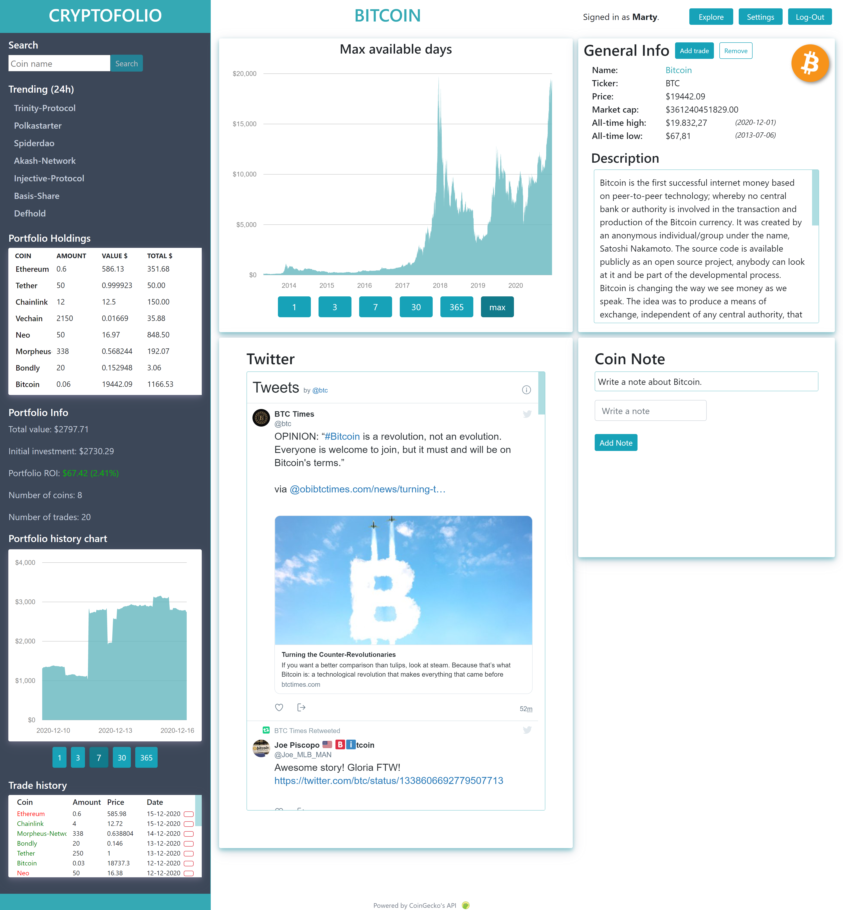

# Cryptofolio
A clean cryptocurrency portfolio tracker that shows price data, social media data and has the functionality to explore new investment opportunities. 

By Martijn van Veen

 
  

## Problem statement
The cryptocurrency industry has developed a lot in the recent years and is expected to grow even more in the coming years. This can be seen from the dozens of new startups that are added daily with the accompanying coins and tokens, each with their own value.
Due to the immature and small market, these prices fluctuate a lot and information about these coins can be found scattered on many different platforms. This can be very unclear and inefficient for the investor.

## Solution description
This application will solve the problem of scattered information. The user can follow the developments of his or her investments on one location without excessive information while still being able to follow current cryptocurrency developments and trends. Users can also look for new investments opportunities and current trends. All on a clean looking website without excessive information.

## Acknowledgements
I would like to thank CoinGecko for providing real-time cryptocurrency data at no cost.  
https://www.coingecko.com/en/api 
