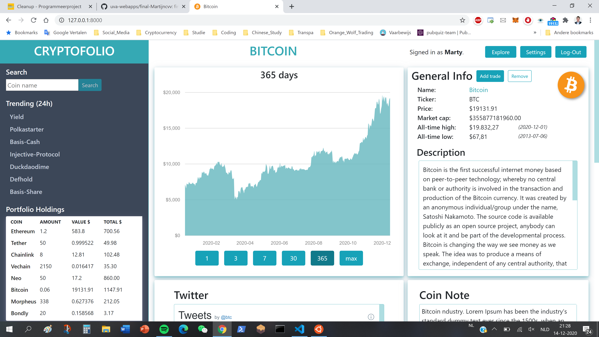
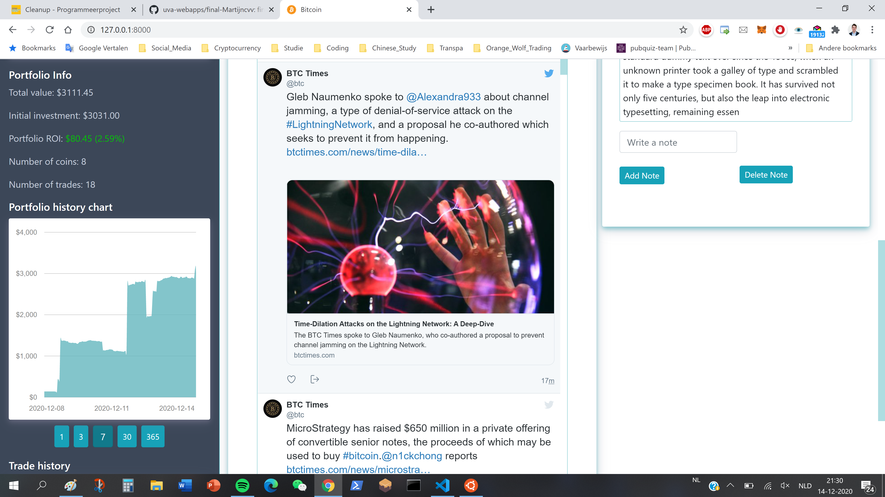
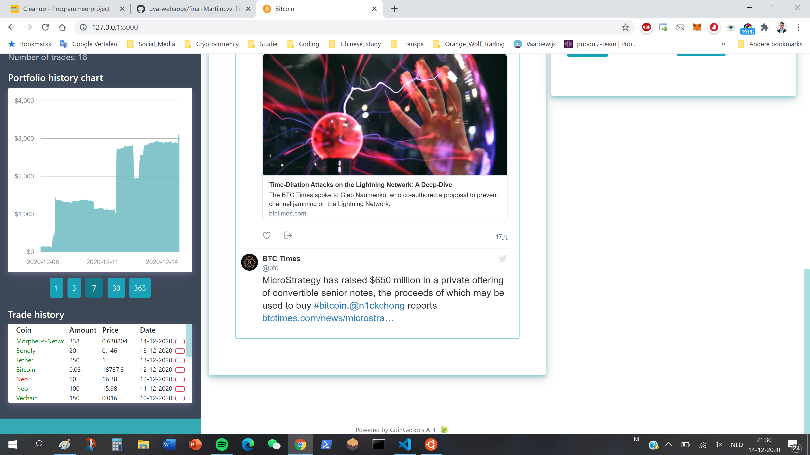
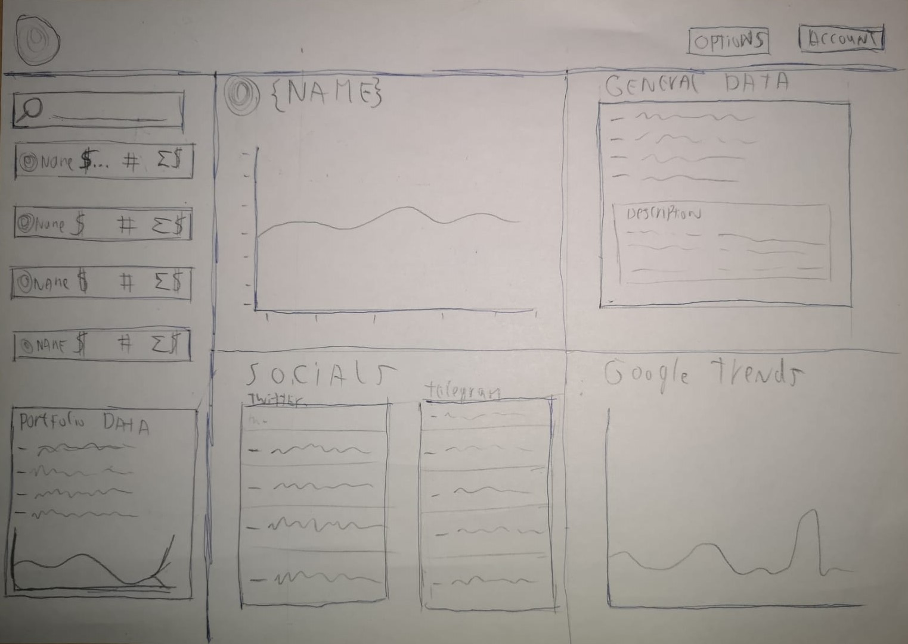

# Cryptofolio
A cryptocurrency portfolio tracker that shows price data and social media data from different other sources.
By Martijn van Veen

## Problem statement
The cryptocurrency industry has developed in recent years and is expected to grow significantly in the coming years. This can be seen from the dozens of new startups that are added daily with the accompanying coins and tokens, each with their own value.
Due to the immature and small market, these prices fluctuate a lot and information about these coins can be found scattered on many different platforms. This can be very unclear and inefficient for the investor.

## Solution description
This application will solve the problem of scattered information. The user can follow the developments of his or her investments on one location. 

## Details and sketches
The goal is to keep the website as clean as possible. The user will be able to search and add tokens on the left side. By clicking on a certain coin the data of that specific coin will be displayed at the right side.

### Data sources
- Cryptocurrency price data; API
https://www.coingecko.com/api/documentations/v3#/simple/get_simple_price 
- Twitter account data; API
https://developer.twitter.com/en/docs/twitter-api/users/lookup/introduction 
- Telegram news channel data; API
https://core.telegram.org/widgets/post 
- Google trends search data; Embedded script
https://trends.google.com/trends/explore?q={coin}&geo=US 

### External components
- Bootstrap; layout functionality for dynamic layout of the website

### Similar websites
- CoinGecko
  - A website that displays coin prices.
  - Displays current prices, total value and profit/loss.
  - https://www.coingecko.com/en

- Blockchair
  - A website that displays coin prices and blockchain block data.
  - Displays current coin price and total portfolio value.
  - https://blockchair.com/
  
- Differences
  - What Cryptofolio does differently is adding social media and news data.

### Hardest part
- I think the hardest part is getting and displaying price/social media data due to inexperience with APIs. I have done an API exercise once but I do not know what difficulties I can run into. If I am unable to retrieve price data from the cryptocurrency market, I can choose to use data from the general stock market.
- Another difficulty are the graphs and how I can display historical portfolio data of the user's portfolio. If I'm not able to add graphs I can choose to drop that functionality or use an embedded price graph provided by a third party.

